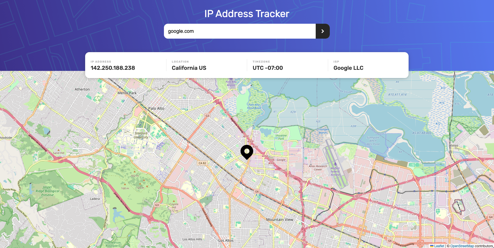

# Frontend Mentor - IP address tracker solution

This is a solution to the [IP address tracker challenge on Frontend Mentor](https://www.frontendmentor.io/challenges/ip-address-tracker-I8-0yYAH0). Frontend Mentor challenges help you improve your coding skills by building realistic projects.

## Table of contents

- [Overview](#overview)
  - [The challenge](#the-challenge)
  - [Links](#links)
- [My process](#my-process)
  - [Built with](#built-with)
  - [The composables created](#the-composables-created)
  - [What I learned](#what-i-learned)
- [Author](#author)

## Overview

### The challenge

Users should be able to:

- View the optimal layout for each page depending on their device's screen size
- See hover states for all interactive elements on the page
- See their own IP address on the map on the initial page load
- Search for any IP addresses or domains and see the key information and location

### Links

- Solution URL: [Add solution URL here](https://your-solution-url.com)
- Live Site URL: [Link](https://fem-ip-address-tracker-ryc.netlify.app/)
- Repository URL: [Link](https://github.com/ricardoychino/fem-ip-address-tracker)

## My process

### Built with

- TypeScript
- SCSS
- Flexbox
- Mobile-first workflow
- [Vue 3](https://vuejs.org/) w/ Composition API
- [Composables](https://vuejs.org/guide/reusability/composables.html#composables)
- [Vue Transitions](https://vuejs.org/guide/built-ins/transition.html#transition)
- Pinia
- [Leaflet.js](https://leafletjs.com/)
- [Axios](https://axios-http.com/docs/intro)

### The composables created:

#### useLeaflet
This one holds the logic to render the map to the layout, centering all the logic of the *[Leaflet.js](https://leafletjs.com/)* usage

#### useGeolocationAPI
Everything related to requests to [IP Geolocation API](https://geo.ipify.org/) are here

#### useCachedResponses
Since I have only 1000 credits available for the API above, I needed to avoid the requisition if not necessary. To do this, the idea is to cache previous results in a hash map stored at localStorage. This composable was created to encapsulate the logic and limit the actions

### What I learned

My main objective with this project was to get hands on with `Pinia` and apply some more implementation with composables.

The typing in TS here was kind of laborious too. Especially I learned that I shouldn't declare and type an emit with an existing event like 'submit'

Another point to highlight is that LeetCode-ish code are helpful indeed. The [IP validator exercise I did before at CodeSignal](https://app.codesignal.com/arcade/intro/level-5/veW5xJednTy4qcjso) helped with test cases. I just added the solution I submitted before to the project

## Author

- Frontend Mentor - [@ricardoychino](https://www.frontendmentor.io/profile/ricardoychino)
